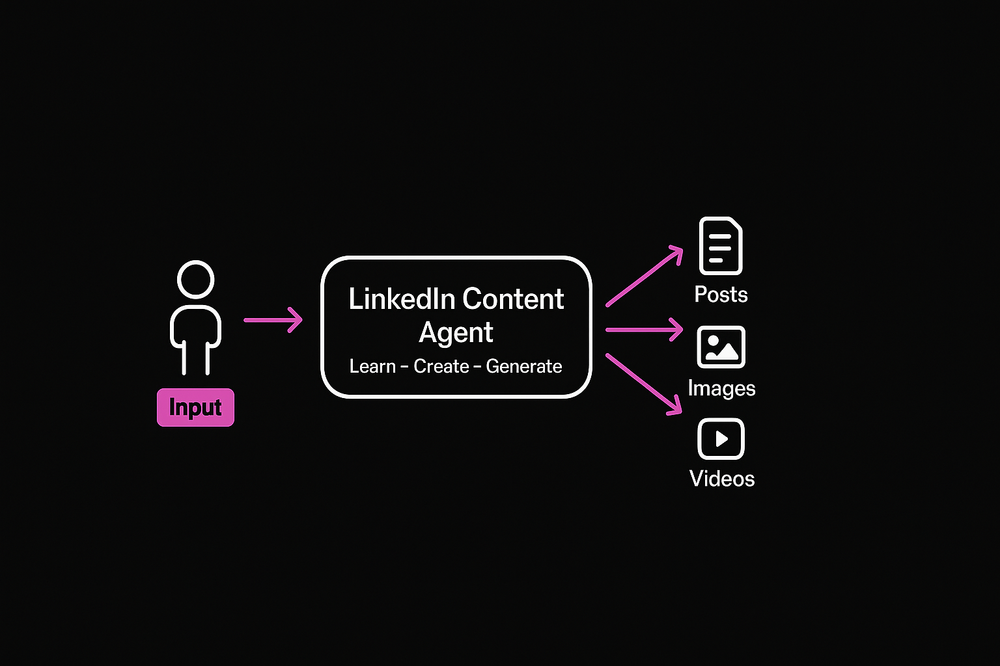

# LinkedIn Content Agent

A CLI-based AI agent that learns from successful LinkedIn posts and generates authentic content with accompanying media.

Created by [Du'An Lightfoot](https://duanlightfoot.com) | [@labeveryday](https://github.com/labeveryday)



## Features

- **Learn** - Analyze posts from successful creators to extract patterns (hooks, structure, tone, CTAs)
- **Screenshot Analysis** - Analyze screenshots of LinkedIn posts and memes using Gemini vision (supports batch analysis of 3600+ images)
- **Create** - Generate authentic posts that match learned styles
- **Media** - Generate images, videos (4-8s with audio), format code snippets
- **Agent Hub** - Session tracking, metrics export, versioned prompts, agent registry (S3 or local)

## Quick Start

```bash
# 1. Clone and setup
cd linkedin-content-agent
python -m venv .venv
source .venv/bin/activate
pip install -r requirements.txt

# 2. Configure API keys
cp .env.example .env
# Edit .env with your API keys

# 3. Initialize project
python cli.py init

# 4. Add posts to learn from
# Copy LinkedIn posts into creators/ folder:
#   - Text: .md or .txt files
#   - Screenshots: .png, .jpg, .jpeg, .webp files

# 5. Learn patterns
python cli.py learn

# 6. Generate content
python cli.py create "Write about building AI agents"
```

## CLI Commands

```bash
# Initialize project folders
python cli.py init

# Learn from creator posts
python cli.py learn
python cli.py learn --source ./my-posts/

# Generate posts
python cli.py create "Your topic here"
python cli.py create "Python tips" --image        # With image
python cli.py create "Code review" --code         # With code snippet
python cli.py create "AI trends" --variations 3   # Multiple versions

# View learned patterns
python cli.py patterns

# Interactive chat mode
python cli.py chat
```

## Project Structure

```
linkedin-content-agent/
├── cli.py                    # CLI entry point
├── linkedin_agent/
│   ├── agent.py              # Main Strands agent
│   ├── models/               # Model providers (Claude, Gemini)
│   ├── tools/                # Agent tools
│   │   ├── post_analyzer.py  # Read and analyze posts
│   │   ├── post_writer.py    # Generate and save posts
│   │   ├── image_gen.py      # Gemini image generation
│   │   ├── gemini_video.py   # Veo video generation
│   │   ├── gemini_image_understanding.py  # Screenshot analysis
│   │   ├── carbon_image.py   # Code screenshot generation (Carbon)
│   │   └── code_formatter.py # Code snippet formatting
│   ├── hooks/                # Agent hooks
│   │   └── logging_hook.py   # Tool invocation logging
│   ├── hub/                  # Agent Hub integration
│   │   ├── config.py         # S3/local configuration
│   │   ├── session.py        # Session management
│   │   ├── metrics.py        # Metrics export
│   │   ├── prompts.py        # Versioned prompts
│   │   └── registry.py       # Agent registry
│   └── storage/              # Pattern storage
├── creators/                 # Input: posts + screenshots
├── output/                   # Generated content
├── patterns/                 # Learned patterns (JSON)
└── PLAN.md                   # Full project plan
```

## How It Works

### 1. Learning Phase

Add posts to the `creators/` folder, then run:

```bash
python cli.py learn
```

The agent analyzes **both text files and screenshots**:

**From text files (.md, .txt):**
- **Hooks** - Opening lines that grab attention
- **Structure** - Format, length, use of bullets/emojis
- **Tone** - Voice, personality, formality
- **CTAs** - Calls to action that drive engagement
- **Topics** - Common themes

**From screenshots (.png, .jpg):**
- **Visual patterns** - Layout, composition, colors
- **Meme formats** - What humor styles work
- **Text placement** - How text is positioned on images
- **Engagement elements** - What makes posts stand out

Screenshots are analyzed in batch using Gemini vision, allowing pattern recognition across multiple posts at once.

Patterns are saved to `patterns/patterns.json`.

### 2. Creation Phase

Generate posts based on learned patterns:

```bash
python cli.py create "Share 3 tips for building AI agents"
```

The agent applies learned patterns to create authentic content that matches the style of your input posts.

### 3. Media Generation

Add images, videos, or code to your posts:

```bash
# Generate with an image
python cli.py create "Python debugging tips" --image

# Generate with a video (4-8 seconds, with audio)
python cli.py create "Day in the life of a DevRel" --video

# Include a code snippet (formatted text)
python cli.py create "My favorite Python one-liner" --code

# Generate beautiful code screenshot image (via Carbon)
# In chat mode:
> Generate a code image for: print("Hello LinkedIn!")
```

**Code images** use [Carbon](https://carbon.now.sh) with 28+ themes (dracula, monokai, nord, etc.) to create shareable code screenshots.

**Video formats supported:**
- Aspect ratios: 16:9 (landscape), 9:16 (portrait - optimal for LinkedIn feed)
- Resolutions: 720p, 1080p
- Duration: 4-8 seconds per generation (extendable to 148s)
- Audio: Native audio generation (dialogue, sound effects) on Veo 3.x

## Example Prompts

Here are some example prompts to get you started:

**Learning:**
```bash
# Analyze text posts
python cli.py learn

# Analyze from a different folder
python cli.py learn --source ./my-screenshots/
```

**Creating posts:**
```bash
# Basic post
python cli.py create "3 lessons I learned from failing my AWS certification"

# With an image
python cli.py create "Why every developer should learn Kubernetes" --image

# With a video (great for LinkedIn algorithm)
python cli.py create "A day in the life of a DevRel" --video

# With code snippet
python cli.py create "My favorite Python one-liner for parsing JSON" --code

# Multiple variations to choose from
python cli.py create "Hot take: Terraform is overrated" --variations 3
```

**Interactive mode:**
```bash
python cli.py chat

# Then try:
> Analyze the screenshots in creators/ and tell me what hooks work best
> Write a post about building AI agents, make it sound like the creators I learned from
> Generate a meme-style image about debugging at 3am
> Create a 6-second video intro for my post about cloud architecture

# Use external content as source:
> Use https://example.com/blog-post to create a LinkedIn post with 3 tips on building agents
> Fetch this article and turn it into a LinkedIn carousel outline: https://...
```

## Environment Variables

```bash
# Required
ANTHROPIC_API_KEY=sk-ant-...    # For content generation (Claude)
GOOGLE_API_KEY=...               # For images + screenshot analysis (Gemini)

# Hub Configuration (optional - defaults to local storage)
USE_S3=false                     # Set to true for S3 storage
AGENT_HUB_BUCKET=your-bucket     # S3 bucket name
AGENT_HUB_REGION=us-east-1       # AWS region
```

## Technology Stack

| Component | Technology |
|-----------|------------|
| Framework | [Strands Agents](https://github.com/strands-agents/strands-agents) |
| CLI | Typer + Rich |
| Writing | Claude (Anthropic) |
| Images | Gemini Image Generation |
| Code Images | Carbon (via Playwright) |
| Video | Veo 3.1 (text-to-video, image-to-video, extension) |
| Vision | Gemini 2.5 Flash (screenshot analysis) |
| Hub | S3 or local (sessions, metrics, prompts) |
| Storage | Local JSON |

## Development

```bash
# Run in development
source .venv/bin/activate
python cli.py chat

# Run the agent module directly
python -m linkedin_agent.agent
```

## License

MIT
